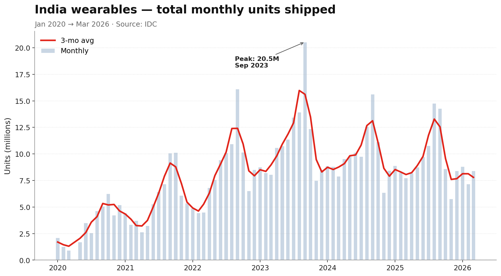
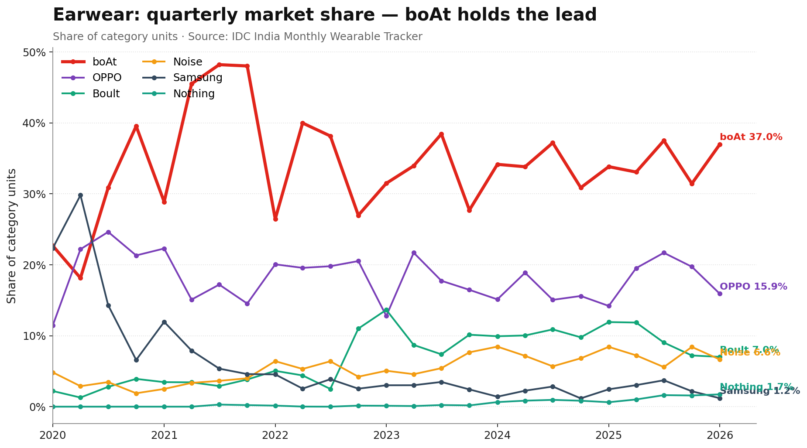
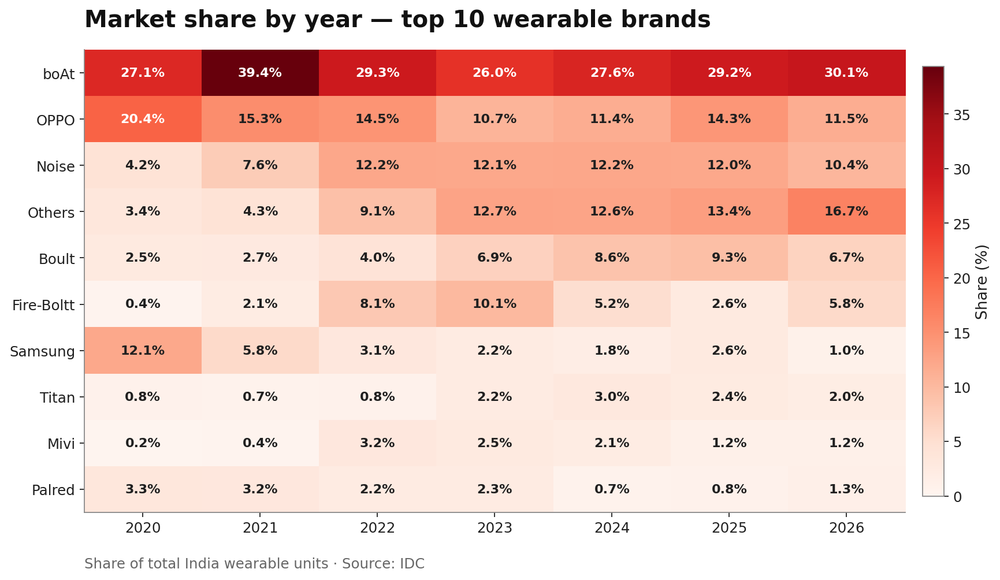

# Competitor Insights — boAt in India Wearables

**Period analysed:** Apr 2025 – Mar 2026 (trailing 12 months) · **Source:** IDC India Monthly Wearable Tracker (FinalHistoricalPivot 2026-03 release)

---

## TL;DR — what your CMO needs to know in 30 seconds

1. **boAt is decisively #1 in India wearables: 29.7% share, 33.7M units, 2.6× the size of #2 Noise.** That moat is built on Earwear (35% category share) where we have no peer.
2. **But the music has stopped.** The total India wearables market shrank **−3.9% YoY** (118M → 114M units). boAt grew **+0.2%** — essentially flat. The growth story we built the brand on is over for now.
3. **The Smartwatch slot is slipping.** We were #1 in 2021 (~27% share). Today we are **#3 at 14.3%**, behind Noise (25.2%) and Fire-Boltt (17.4% and rising). Titan owns the premium end (₹2,200 ASP) — we don't show up there.
4. **OPPO is the silent threat in Earwear.** Its share jumped **+3.7 pp YoY to 19.6%** — that 3.7-point gain came directly out of Boult, "Others", and a sliver of ours. They are pricing aggressively through OPPO/Realme/OnePlus retail.
5. **Two new categories are real.** Smart Rings (boAt #3 at 17.6%, +6.9 pp YoY — well done) and Smart Glasses (+987% YoY, dominated by Meta — **we are absent and that is a problem**).

---

## 1. Market context — the wearables ride is over (for now)

The India wearables market peaked at **20.6M units in Oct 2022** (Diwali festive) and again hit ~16M in Oct 2023. The last 12 months averaged **9.5M units/month** — down meaningfully. Drivers we should investigate:

- Smartwatch saturation in Tier-1/2 (replacement cycle slowing).
- Wrist-band category functionally dead (only Samsung Galaxy Fit + a niche Whoop/Garmin/SRK contingent remains — 411K units total).
- TWS commoditisation: ASPs in Earwear are in the ₹500–800 range for non-premium players.

**Implication:** future growth is not from "more wearables to more people". It comes from **(a) premium up-sell, (b) new categories (rings, glasses), (c) ecosystem lock-in**.

---

## 2. Category-by-category competitive read

### 2.1 Earwear — boAt's fortress, but OPPO is at the gates

| Brand | Share (12 mo) | YoY change | Read |
|---|---|---|---|
| **boAt** | **35.2%** | +0.9 pp | Held the line. Not growing. |
| OPPO | 19.6% | **+3.7 pp** | Aggressive pricing via OPPO/Realme/OnePlus channels |
| Boult (GoBoult) | 8.9% | −1.7 pp | Lost share to OPPO |
| Noise | 6.8% | −0.1 pp | Stable |
| Nothing | 1.5% | small | Premium pull-in; watch for Nothing Ear (3) cycle |

**Recommended actions:**
- Launch a clear sub-₹999 SKU range to *defend* against OPPO, not just compete on features.
- Use the Rockerz / Airdopes brand equity to push **premium ₹2,500–4,500 ANC** to lift our category ASP (currently dragged down by mass-market).
- Marketing spend reallocation: less brand, more retail-display in Tier-2/3 where OPPO is winning.

### 2.2 Smartwatch — we let the lead slip

| Brand | Share (12 mo) | YoY change | ASP (₹) | Read |
|---|---|---|---|---|
| Noise (Nexxbase) | **25.2%** | −1.0 pp | 1,609 | #1 today; richer ASP than us |
| Fire-Boltt | 17.4% | −1.2 pp on year, **+5 pp last 6 mo** | 1,289 | Bouncing back hard |
| **boAt** | **14.3%** | +1.1 pp | 1,398 | #3. Recovering — but from a low base |
| Titan | 7.7% | −3.2 pp | 2,206 | Premium leader |
| Boult | 5.9% | new entrant | 1,209 | Cross-leveraging Earwear distribution |

The price-positioning map is the most important slide in this deck.

- **Noise dominates volume** at ₹1,600 ASP — they extract ~₹14 more per watch than we do.
- **Titan & SRK Powertech own the ₹2,100+ premium** — that air is empty for boAt.
- **"Others" (24% category share!) sit at ₹757 ASP** — that's the white-label chip pool. They will get squeezed when the next IDC tightens reporting; some of that share is recoverable.

**Recommended actions:**
- Build a flagship boAt Wave / Lunar **₹2,499–3,499** sub-brand with proper Always-On AMOLED, BT-calling and a hard premium positioning — go for the Titan/Apple-aspirant.
- Bundle smartwatch + earbud in one box at ₹1,999 to leverage our Earwear advantage as a category cross-sell. No competitor can match that.
- Push BT-calling SKUs (Noise's signature) — feature gap, not a brand-equity gap.

### 2.3 Smart Rings — quietly the most interesting story

| Brand | Share (12 mo) | YoY change |
|---|---|---|
| Ultrahuman | 25.5% | −13.9 pp (losing) |
| Gabit | 23.8% | **+16.5 pp** |
| **boAt** | **17.6%** | **+6.9 pp** |
| Aabo | 9.8% | −10.6 pp |

We are **#3 and gaining**. The category is small (217K units / yr) but doubled twice over two years.

**Recommended actions:**
- Double down. Push the boAt Smart Ring into the boAt Earwear bundle program ("smart wellness kit").
- Run a wellness-positioning campaign — Ultrahuman owns "biohacker premium", Gabit owns "athletes", we should own **"mainstream daily wellness"**.

### 2.4 Smart Glasses — we are missing in action

| Brand | Share (12 mo) | YoY change |
|---|---|---|
| Meta (Ray-Ban) | 34.0% | +34 pp (new) |
| Lenskart | 27.2% | −12.8 pp |
| Fire-Boltt | 21.3% | new entrant |

Market is **+987% YoY** off a tiny base (272K units). It's still the smallest category, but in 24 months it could rival Rings or even Wrist Bands. Fire-Boltt has already shown that an Indian D2C player can take 21% inside one launch cycle.

**Recommended actions:**
- Greenlight a feasibility study for boAt Glasses Q4 FY27. Target: open-ear audio glasses (we know audio, we don't need a display in v1).
- Strategic partnership scout: Lenskart (distribution), Meta (don't touch — keep them as the premium ceiling).

---

## 3. Three things I'd put on the manager's desk tomorrow

1. **Defence brief on OPPO Earwear.** Their +3.7 pp gain is the biggest single competitive move in the last 12 months. We need pricing, channel, and ad-spend response within 30 days.
2. **Premium Smartwatch product spec.** boAt's brand can carry ₹2,500–3,500 if the product is right. Use the Crest / Lunar sub-brands to insulate the mass-market boAt brand. Target launch: festive 2026.
3. **boAt Glasses R&D request.** Smart-glasses is the only category with >100% growth and no Indian volume leader yet. First-mover for D2C audio glasses is worth a small bet.

---

## 4. What I would track every Monday

| KPI | Why |
|---|---|
| boAt overall share (rolling 3-mo) | Headline number — must stay > 28% |
| boAt Earwear share (rolling 3-mo) | Watch OPPO encroachment week-on-week |
| boAt Smartwatch share & ASP | Both must climb together (volume + premium) |
| Fire-Boltt smartwatch share | Best leading indicator for the #3-vs-#2 gap |
| Total market units (3-mo avg) | Tells us when the category is recovering |
| New entrants in Glasses | Early-warning for the next category land-grab |

A simple `pandas` notebook on top of `data/clean/wearables_long.parquet` produces all of these in ~10 lines of code — happy to wire up an auto-refresh when next month's IDC drops.

---

## 5. Data, methods, caveats

- **Source.** IDC India Monthly Wearable Tracker, FinalHistoricalPivot, 2026-03 release. Used "as-is" with no external assumptions.
- **Units only.** All share % are unit-share. Value-share would skew toward Apple/Titan but is less useful for boAt's mass-market positioning.
- **YoY comparison.** Trailing 12 mo (Apr 2025 – Mar 2026) vs prior 12 mo (Apr 2024 – Mar 2025).
- **"Others" line** = aggregated long-tail in IDC. Treated as a single competitor in heatmaps; broken out conservatively in trend lines.
- **April 2020 missing** in source data (COVID lockdown — no IDC publication). Time series interpolation NOT applied; gap is left visible.
- **boAt = "Imagine Marketing"** in IDC's data dictionary. Verified via per-category category-leader tables matching public boAt disclosures.

All numbers in this document are auto-generated from `data/clean/insights.json` by `scripts/30_insights.py` and will recalculate the moment a new monthly tracker is dropped into the repo.

---

*Prepared on Day 1 of internship — open to feedback, refinements, and additional cuts of the data your team would find useful.*
