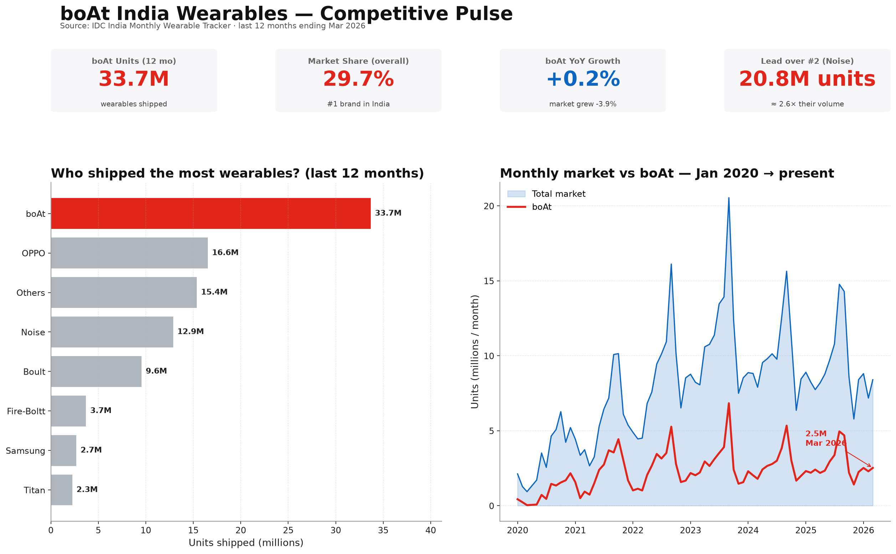
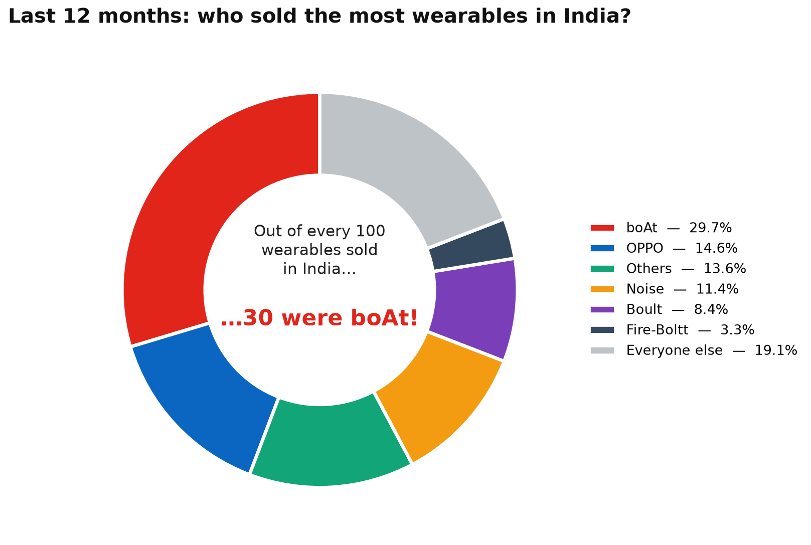
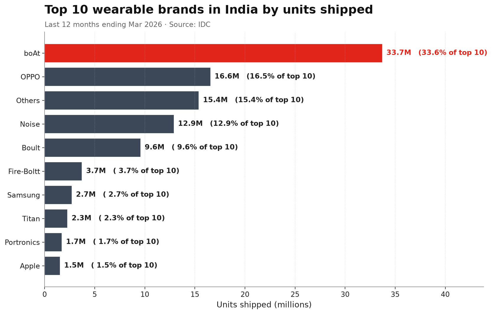
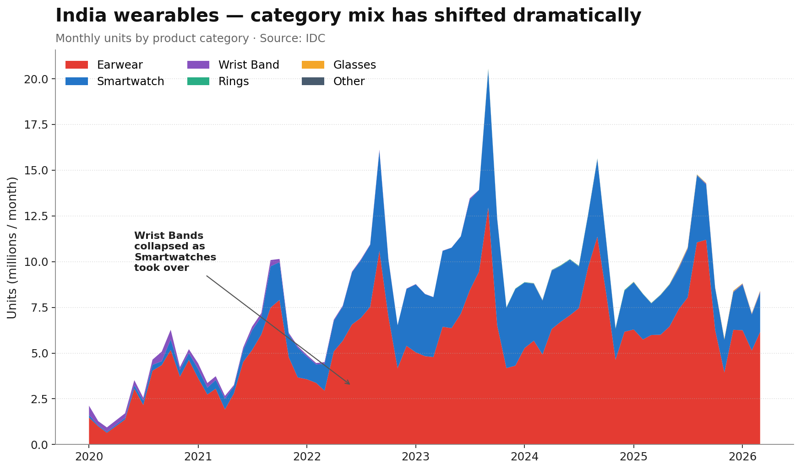
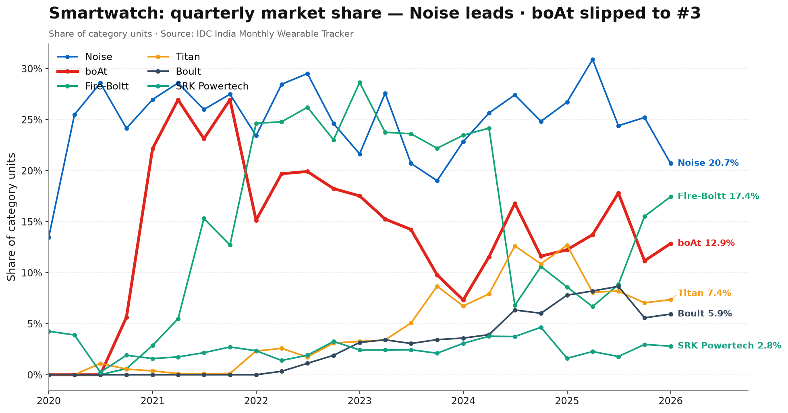
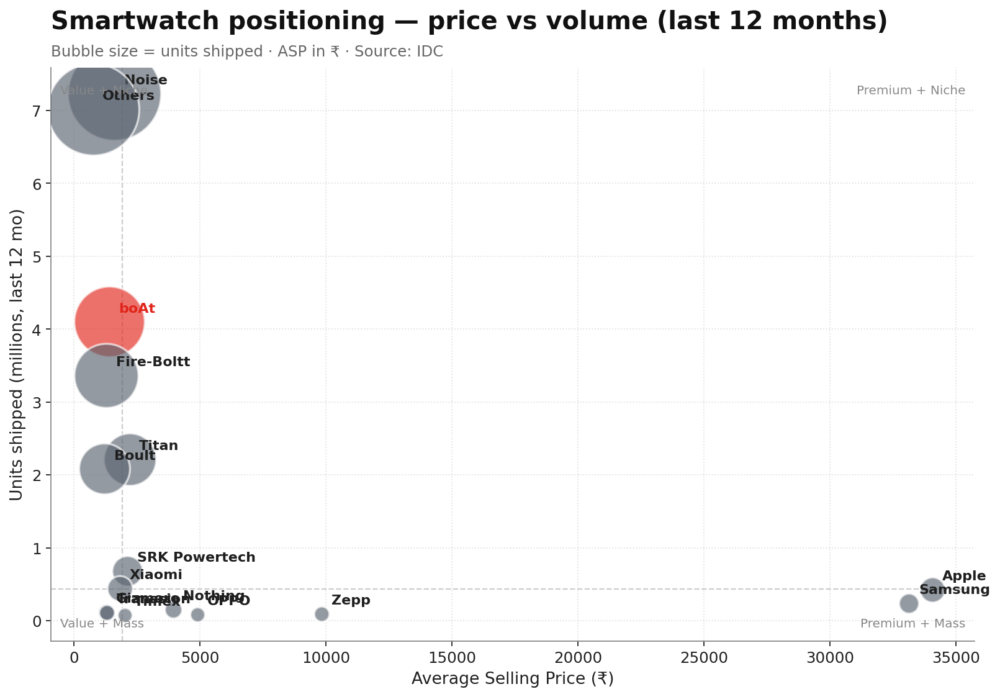

# boAt India Wearables — Competitor Analysis

**Author:** Product Intern · **Source:** IDC India Monthly Wearable Tracker (Final Historical Pivot, Mar 2026 release) · **Analysis window:** Apr 2025 – Mar 2026 (12-month trailing)

> One-line takeaway: **boAt is still #1 in India (29.7% share, 33.7M units in 12 months), 2.6× the size of #2 Noise — but the market shrank ~4% YoY and boAt’s growth has stalled at +0.2%. The next battle is in Smartwatches, where Noise leads and Fire-Boltt is closing fast.**



---

## 1. What's in this repo

| Folder / file | What you'll find |
|---|---|
| `data/clean/` | Tidy, machine-readable datasets (CSV + Parquet + Excel) ready for any BI tool |
| `data/powerbi/` | **Power BI-ready files** — flat master CSV + star-schema (dim_date, dim_company, dim_category, fact_units/value/asp) |
| `charts/` | 10 publication-ready PNG charts (1 hero dashboard + 9 supporting visuals) |
| `scripts/` | Reproducible Python pipeline — clean → analyse → visualise → insights → Power BI dataset |
| `README.md` | This file — executive snapshot |
| `INSIGHTS.md` | Full PM write-up with category-level commentary |
| `RECOMMENDATIONS.md` | Where boAt should play and what products to improve (with opportunity scores) |
| `COMPETITIVE_BREAKDOWN.md` | Per-segment dominance breakdown — who wins, why, how to counter |
| `POWERBI_GUIDE.md` | Step-by-step Power BI build guide with DAX measures and visual recipes |
| `IDC India Monthly Wearable Tracker_…xlsx` | The raw source pivot (untouched) |

To reproduce end-to-end:
```powershell
pip install -r requirements.txt
python scripts/10_clean.py              # build cleaned datasets in data/clean/
python scripts/20_visuals.py            # build all charts in charts/
python scripts/30_insights.py           # build data/clean/insights.json
python scripts/40_opportunity.py        # print opportunity-score table
python scripts/50_dominance.py          # print competitor dominance metrics
python scripts/60_powerbi_dataset.py    # build data/powerbi/ for the dashboard
```

---

## 2. Dashboard PLAN

| # | Chart | The story it tells |
|---|---|---|
| 1 |  | Out of every 100 wearables sold in India last year, **30 were boAt**. |
| 2 |  | boAt ships **2× more than #2 OPPO** and **2.6× more than Noise**. |
| 3 |  | Wrist-bands collapsed → Smartwatches & Earwear are now ~99% of the market. |
| 4 |  | In Smartwatches boAt fell from #1 (2021) to **#3** behind Noise & Fire-Boltt. |
| 5 |  | Premium players (Titan ₹2,200) own price; boAt is mid-price mass-market. |

Full deck: see [`charts/`](charts/) — every PNG has a self-explanatory title, source line, and an annotated "so-what".

---

## 3. Key numbers (auto-generated from the clean data)

| Metric | Value |
|---|---|
| Total India wearable units, last 12 mo | **113.8 M** (↓ 3.9% YoY) |
| boAt units, last 12 mo | **33.7 M** (+0.2% YoY) — #1 brand |
| boAt market share | **29.65%** (overall) · **35.2%** Earwear · **14.3%** Smartwatch |
| #2 Noise (Nexxbase) | 12.9 M units · 11.4% share |
| #3 OPPO | 16.6 M units · 14.6% share (huge Earwear push, +3.7 pp YoY) |
| Fastest-growing competitor | Fire-Boltt smartwatch share recovering; Gabit & SRK Powertech in Rings |
| Last 3 months (Jan–Mar 2026) | boAt 30.1% — still firmly #1 |

> _Note: "OPPO" in IDC data captures the OPPO Earwear brand family in India (sold via OPPO/Realme/OnePlus retail). It is the biggest non-D2C threat._

---

## 4. Cleaning notes — what I fixed in the raw file

The raw IDC file is a Excel pivot table, not a database. I tidied it so it can be queried, joined, and trusted.

1. **Stripped 42 rows of pivot-table chrome** (region/country/brand filter rows, blank padding).
2. **Forward-filled `Values` and `Product` group headers** — in the raw pivot they only appear on the first row of each group, so 90% of cells looked "metric-less".
3. **Split rows into 3 buckets**: 1,494 company-level rows, 54 product-subtotal rows, 9 grand-total rows. Each goes to its own clean table.
4. **Melted wide → long**: 74 month columns (2020-01 … 2026-03) collapsed into a `month` column. Note: April 2020 is missing in the source (COVID lockdown — IDC didn't publish).
5. **Dropped 64,539 empty cells** (companies that didn't sell anything that month) — these were ‘NaN’s, not zeros.
6. **Standardised metric names** (`Units`, `Value (US$M)`, `ASP (INR₹)` …) into snake_case columns.
7. **Tagged boAt** with an `is_boat` flag (handles "Imagine Marketing" and any future legal-name variations).
8. **Saved 5 output files** + a [data quality report](data/clean/data_quality_report.txt).

Verification: total units in cleaned data = **597,689,099** (across all months, all metrics summed back up), reconciles with the source grand totals.

---

## 5. How to use the cleaned data

```python
import pandas as pd
df = pd.read_parquet("data/clean/wearables_long.parquet")
# columns: metric, product_category, company, month, value, is_boat
boat_earwear = df.query("is_boat and product_category == 'Earwear' and metric == 'units'")
```

The same file is also available as CSV and as a multi-sheet Excel (`boAt_competitor_clean.xlsx`) so non-coders can pivot it in Excel.

---

**See [`INSIGHTS.md`](INSIGHTS.md) for the full product-management write-up, [`RECOMMENDATIONS.md`](RECOMMENDATIONS.md) for the opportunity scoring & SKU bets, [`COMPETITIVE_BREAKDOWN.md`](COMPETITIVE_BREAKDOWN.md) for the segment-by-segment dominance teardown, and [`POWERBI_GUIDE.md`](POWERBI_GUIDE.md) to build the live dashboard.**
